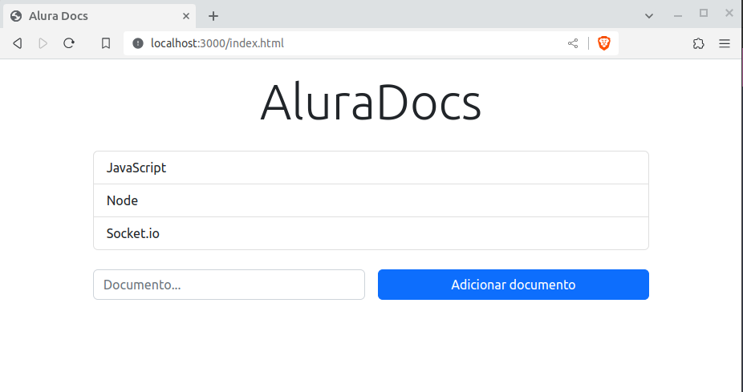
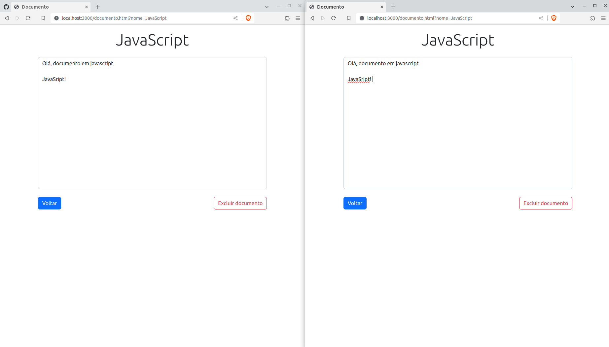

# aluradocs

## 📋 Índice
- [📖 Sobre](#-Sobre)
- [🚀 Tecnologias utilizadas](#-Tecnologias-utilizadas)
- [📌 Como executar o projeto](#-Como-executar-o-projeto)
- [🖥 Preview](#-Preview)
- [🎓 Certificados](#-Certificados)

## 📖 Sobre
Projeto desenvolvido durante o curso de [WebSockets: implemente comunicações em tempo real com Socket.IO e MongoDB](https://cursos.alura.com.br/course/websockets-comunicacoes-tempo-real-socket-io-mongodb) da Alura.

## 🚀 Tecnologias utilizadas
O projeto foi desenvolvido utilizando as seguintes tecnologias:

- [Node.js](https://nodejs.org/en)
- [Socket.IO](https://socket.io/)
- [Express](https://expressjs.com/)
- [MongoDB](https://www.mongodb.com/pt-br)
- [Docker](https://www.docker.com/)

## 📌 Como executar o projeto

Primeiro é preciso subir uma instância do mongodb:

```bash
docker pull mongo

docker run
  --name aluradocs
  -p 27017:27017
  -e MONGO_INITDB_ROOT_USERNAME=admin
  -e MONGO_INITDB_ROOT_PASSWORD=password
  -d mongo

docker start aluradocs
```

Depois execute o projeto node:
```bash
npm run dev
```

## 🖥 Preview:
<p align="center">
  
  
</p>

## 🎓 Certificados
### [Curso de WebSockets: implemente comunicações em tempo real com Socket.IO e MongoDB](https://cursos.alura.com.br/certificate/6ce6e460-246e-4dd0-b8b1-44171de391cb?lang=pt_BR)
